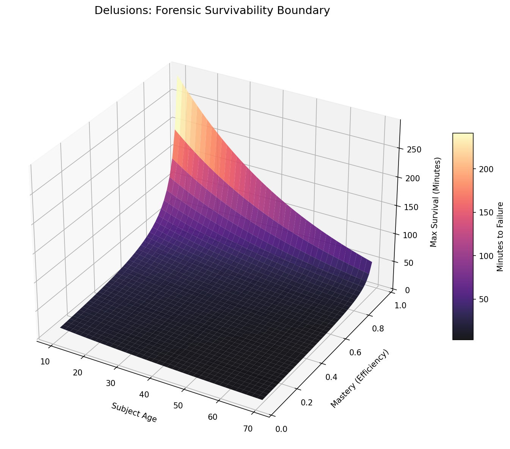

# Phase 3: Linear Programming and the "Human Tax" Optimization
## Project Overview
This project utilizes Linear Programming (LP) to quantify the active destruction caused by Delusion usage. By treating a subject's biological life force as a non-renewable resource, we mathematically prove that Delusion technology is a guaranteed death sentence for standard humans. **DO NOT EXPERIMENT ON HUMANS, DOTTORE**

## Problem Setup
We move from differential equations to Constrained Optimization using `scipy.optimize.linprog`.
The goal is to maximize "Combat Duration" while staying within the narrow "Feasibility Region" defined by biological failure points. We introduce two key constants:

1. The Mastery-Efficiency Coefficient ($\eta$):       
To differentiate between the "Disposable Agents" and the "Fatui Harbingers," we introduce a Mastery Coefficient.
- High Mastery (Arlecchino-tier): Minimal energy leakage; 90% of the Delusion's output is converted to elemental flux (active flow of elemental energy through a biological system), leaving only 10% as biological waste.
- Low Mastery (NPC/Agent-tier): Massive "waste-flux" (up to 99%) that cooks internal systems and exhausts redundancy reserves instantly.

2. The Vision-Damping Factor ($\zeta$):      
A Vision acts as a "Biological Grounding Wire". In our LP model, this provides a Damping Coefficient that reduces the cost of every second spent in a Delusion state, effectively stretching the "survival fences" outward.

## Results
Our simulation identifies a brutal Bifurcation Point in human survivability:
- *The Mastery Monopoly:* Survival time remains effectively zero for any subject with an efficiency score below 80%. This proves that only the absolute elite can survive Dottore's technology.
- *The Child Paradox:* Subjects aged 10–14 show a slight "uplift" in survival despite low efficiency. This can be explained by the fact that children possess high Initial Redundancy ($R$)—a larger biological "buffer" that Dottore systematically exploits as fuel.
- *The Mortality Cliff:* As age increases, the starting "Life Budget" ($R$) drops exponentially. An elderly subject, even with elite mastery, faces a significantly smaller operating window than a younger peer.

*The 3D surface plot shows the maximum survival time (in minutes) as a function of subject age and combat mastery efficiency. The "Death Boundary" represents the feasibility region where Delusion use becomes fatal.*

## Conclusion
We conclude that Dottore’s "segments" and "delusions" rely on a Negative Feasibility Region for standard humans. By defining the Vision-Damping Coefficient and Mastery Tiers, we have mathematically exposed a system designed to treat human souls as disposable high-flux batteries.