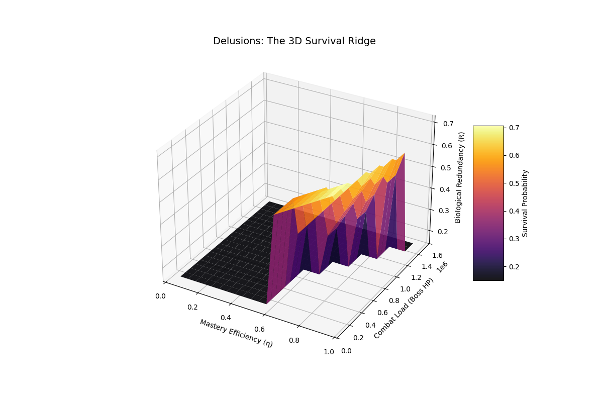
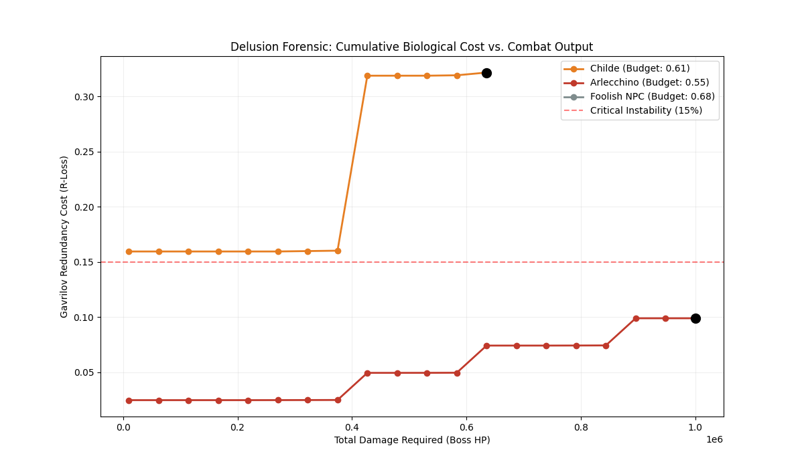

# Phase 3: Linear Programming and the "Human Tax" Optimization
## Project Overview
This project utilizes Constrained Optimization to quantify the active destruction caused by Delusion usage. We have evolved from basic decay models to a Combat Meta-Simulation that treats a subject's biological life force as a non-renewable currency used to "purchase" damage output.

## Problem Setup: The MILP Backend

We utilize `scipy.optimize.linprog` with integrality constraints to solve for the most bio-efficient combat rotation (Normal Attacks, Skills, and Bursts).

### Adaptive Optimization Parameters

To reflect lore-accurate combat mastery, the model now maps the Mastery-Efficiency Coefficient ($\eta$) to the following mechanical variables:

- **Skill Cooldown ($CD$)**: Ranges from 12s (Low Mastery) to 7s (High Mastery).
- **Burst Energy Requirement ($Q_{req}$)**: Ranges from 90 to 80 energy.
- **Energy Generation ($E_{gen}$)**: Scales from 10 to 40 energy per Skill, representing the subject's ability to capture elemental flux.
- **Vision-Damping Factor ($\zeta$)**: Acts as a 1.5x Energy Multiplier and provides a 0.05 safety grounding that reduces biological waste.

## Results

Our simulations against high-HP "Boss" targets reveal three critical findings:

### 1. The Energy-Redundancy Trap

For non-Vision holders (NPCs), the "Human Tax" to generate 80 energy exceeds their total Gavrilov Redundancy ($R$).

- **Result**: NPCs are mathematically barred from using Elemental Bursts.
- **Observation**: Attempting a single Burst triggers a 350x toxicity spike that consumes up to 80% of their life budget in 5 seconds.

### 2. The Harbinger "Survival Ridge"

Harbingers like Arlecchino occupy a unique mathematical plateau.

- **Efficiency Advantage**: At $\eta=0.95$, the "Waste Factor" is so low that the subject can afford multiple high-flux rotations.
- **Temporal Bottleneck**: Their only limit is the Time Constraint (90s), not biological failure.

### 3. The Mortality Cliff (Skull Analysis)

As shown in our 2D/3D visualizations, there is a Bifurcation Point at $\eta \approx 0.7$.

- **$\eta < 0.7$**: Total system failure. The solver returns "Infeasible", marked on our plots with a skull (☠) to indicate immediate biological liquidation.
- **$\eta > 0.7$**: The subject enters the Survival Ridge, where victory is possible at the cost of permanent, but non-fatal, redundancy loss.

*The 3D surface plot shows biological redundancy as a function of mastery efficiency and combat load (boss HP). The "Death Valley" at 0.15 represents the critical failure threshold where Delusion use becomes fatal.*

*The forensic plot shows cumulative biological cost vs. combat output for different subject classes. Each line represents a character's survivability curve, with skull markers (☠) indicating biological collapse points. The red dashed lines mark critical thresholds at 0% (baseline) and 15% (critical instability).*

## Conclusion
Delusion technology is a predatory resource-extraction system. It is mathematically impossible for standard humans to achieve the energy recharge required for high-flux actions (Bursts) without immediate systemic liquidation.