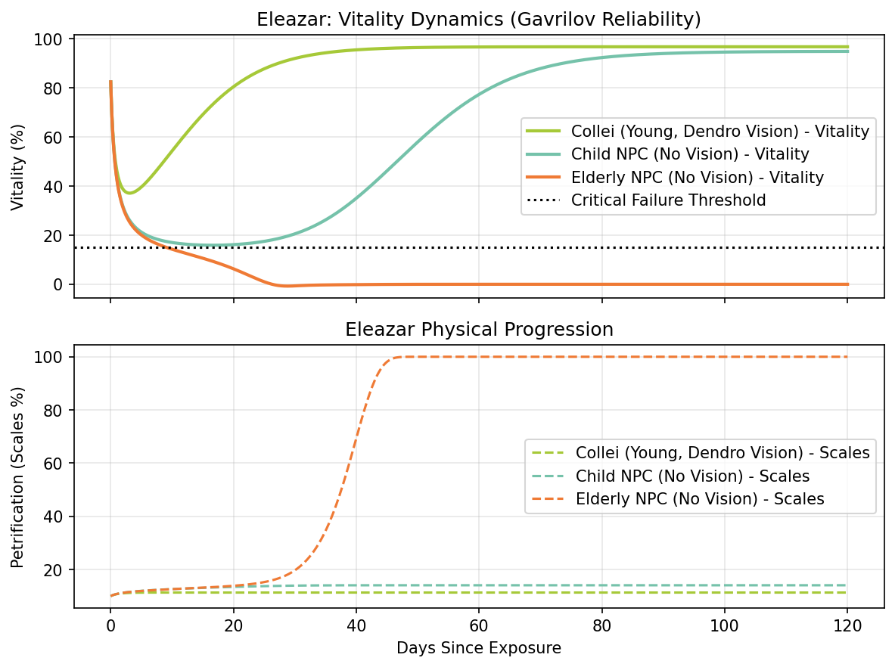
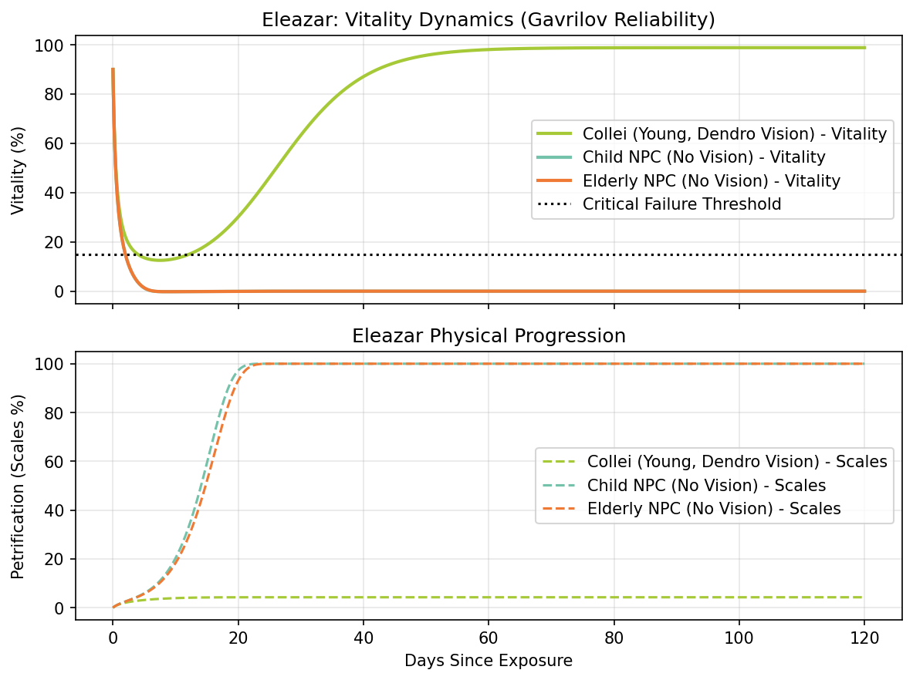

# Phase 2: Eleazar and Biological Reliability

## Project Overview
**Eleazar** is terminal condition caused by the "Withering" manifesting in human hosts.
This project applies a modified version of the **Reliability Theory of Aging** (Gavrilov Model)
to simulate the competition between cellular vitality and Abyssal contamination.

## The Gavrilov-Vision Model
We treat the human body as a system of redundant components.
Failure (Eleazar) occurs when the "redundancy reserve" is exhausted.
The *Gompertz-Makeham Law* is used to define the base mortality and age-dependent decay of a patient.
We also account for the effects of a *Vision*, which we mathematically define as a redundancy buffer,
providing a "metabolic floor" that prevents the exponential "avalanche of failures" typical in terminal Eleazar cases.

## ODE Setup
We implemented a system of three coupled Ordinary Differential Equations (ODEs) to track the patient's state over time:
- $V(t)$ (Vitality): Regenerative life force, constrained by the current redundancy reserve.
- $C(t)$ (Corruption): The concentration of "Forbidden Knowledge" within the body, which scales exponentially as biological reliability ($R$) drops
- $S(t)$ (Scales): The physical petrification rate, acting as a "drag" on vitality.

The system of ODEs is defined as:

$$\frac{dV}{dt} = (\alpha \cdot \phi \cdot R) \cdot V \cdot \left(1 - \frac{V}{100}\right) - (\beta \cdot C \cdot V) - (\delta \cdot S)$$

$$\frac{dC}{dt} = (\gamma \cdot \gamma_{mod} \cdot \text{reliability\_impact}) \cdot C - (0.02 \cdot V \cdot C)$$

$$\frac{dS}{dt} = \kappa \cdot C \cdot \left(1 - \frac{S}{100}\right)$$

where:
- $R = \max(\text{metabolic\_floor}, e^{-k \cdot (\text{age}/10)})$ is the effective vitality reserve (redundancy reserve)
- $\text{reliability\_impact} = \frac{1.0}{R + 0.1}$ is a capped multiplier preventing extreme crashes
- $\alpha, \beta, \gamma, \delta, \kappa$ are base parameters (regen, drain, virulence, scale drag, ossification)
- $\phi$ and $\gamma_{mod}$ are modifiers based on patient type (Vision holder, NPC child, etc.)

## Simulation Results
We simulated the model on three different patients, with different age and vision parameters affecting their vitality and resistance. Our simulations identified a Bifurcation Point: a critical threshold of initial corruption where the body's repair systems can no longer suppress the Abyssal contamination.

### Comparative Patient Analysis

| Patient | Age | Vision | $\phi$ | $\gamma_{mod}$ | Metabolic Floor | Outcome |
|---------|-----|--------|--------|----------------|-----------------|---------|
| **Collei** | 18 | ✓ (Dendro) | 1.30 | 0.30 | 0.45 | Stabilized Chronic - Reaches stable equilibrium via Aegis Effect |
| **Child NPC** | 6 | ✗ | 1.0 | 1.35 | 0.05 | High-Flux Catalyst - High metabolism feeds corruption ($1.35\gamma$) |
| **Elderly NPC** | 80 | ✗ | 1.0 | 1.0 | 0.05 | Exhausted Terminal - Low redundancy leads to rapid collapse |

**Key Observations:**
- **The High-Flux Child (NPC)**: High metabolic rates in children act as a "catalyst" for corruption ($1.35\gamma$), explaining Dottore's interest in youthful subjects for Abyssal testing.
- **The Stabilized Chronic (Collei)**: With a Vision, the patient reaches a Stable Equilibrium. The "Vision Effect" dampens corruption growth, allowing the patient to survive even high-load exposures that would be fatal to a non-Vision holder.
- **The Exhausted Terminal (Elderly NPC)**: Low initial redundancy (due to Gompertzian aging) leads to a rapid, irreversible collapse upon exposure.

*Simulation parameters: Initial state $V_0 = 85.0\%$, $C_0 = 18.5\%$, $S_0 = 10.0\%$; Base parameters $\alpha = 0.12$, $\beta = 0.06$, $\gamma = 0.22$, $\delta = 0.04$, $\kappa = 0.08$; Aging constant $k = 0.035$; Simulation duration: 120 days with 1200 time points.*

By changing the initial starting parameters, we can get different scenarios, where all patients recover or non Vision holders failing to recover. We also demonstrate the power of having a Vision in providing accelerated regeneration and contamination resistance, allowing **Collei** to fully recover despite having high initial contamination.

*Simulation parameters: Initial state $V_0 = 90.0\%$, $C_0 = 30.0\%$, $S_0 = 7.0\%$; Base parameters $\alpha = 0.12$, $\beta = 0.06$, $\gamma = 0.22$, $\delta = 0.04$, $\kappa = 0.08$; Aging constant $k = 0.035$; Simulation duration: 120 days with 1200 time points. This simulation demonstrates recovery scenarios with higher initial corruption, showing how Vision holders can overcome severe contamination.*
