# Phase 1: Deep-Layer Error Correction in the World Tree

## Project Overview
This project treats **Irminsul** (The World Tree) from *Genshin Impact* as a
biological database of Teyvat's history and genetic blueprints.
Just as DNA is subject to mutations, Irminsul is vulnerable to "Forbidden Knowledge,"
a form of high-entropy noise known as *The Withering*.

I implemented a **HMM** (Hidden Markov Model) to detect and cleanse this corruption,
restoring the "True Record" of elemental fluxes using the **Viterbi Algorithm.**

## Biological Syntax of Teyvat
Unlike standard data, elemental records follow a specific mechanistic logic.
We modeled the transition between elements (Pyro, Hydro, Electro, Cryo, Anemo, Dendro, Geo)
as a Markovian process where probabilities are weighted by Elemental Gauge Theory.
Specific features include
- *Stable Chains:* High transition probabilities for reactive pairs like Dendro x Electro (Quicken) or Hydro x Cryo (Freeze)
- *Inert Pairs:* Low probabilities for combinations like Anemo x Geo, which do not react with each other

The Withering (W) is modeled as an Emission Matrix where the true state is hidden behind a mask of Abyssal corruption.

## Technical Details
1. **The Markov Transition Matrix ($A$):**
We defined a $7 \times 7$ matrix representing the "Laws of Nature." This ensures that the restoration algorithm "understands" the chemical context of the data it is repairing.

2. **The Viterbi "Cleansing" Algorithm:**
To restore corrupted records, we implemented the Viterbi algorithm in log-probability space for numerical stability.
> Input: A "Withered" string (e.g., DEWEPWHWG).   
> Process: The algorithm calculates the globally most likely "True" path through the state-space [trellis](#footnote-trellis).    
> Output: A restored elemental sequence.    

```mermaid
%%{init: {'theme': 'base', 'themeVariables': { 'primaryColor': '#ffcccc', 'edgeLabelBackground':'#ffffff', 'tertiaryColor': '#f4f4f4'}}}%%
%% The Viterbi "Cleansing" Trellis (Small Example)
%% This diagram shows the algorithm finding the most likely sequence of hidden elements (the path in green) that would produce the observed corrupted record.
graph LR
    %% ---- DEFINING THE TIME STEPS & OBSERVATIONS ----
    subgraph T0 ["Time t=0, Observed: W (Withered)"]
        P0(Hidden: Pyro)
        H0(Hidden: Hydro)
    end
    
    subgraph T1 ["Time t=1, Observed: P (Pyro)"]
        P1(Hidden: Pyro)
        H1(Hidden: Hydro)
    end

    %% ---- INITIALIZATION (t=0) ----
    %% The algorithm calculates the initial probability of starting in each state
    Start((Start)) -.->|Prob: Low| P0
    Start((Start)) ==>|Prob: High| H0
    %% Note: H0 is selected as the more likely starting point based on emission probs of 'W'

    %% ---- RECURSION (t=0 to t=1) ----
    %% It calculates prob of moving to next states from previous best states
    %% Thin dotted lines are discarded paths with lower probabilities
    P0 -.-> P1
    P0 -.-> H1
    
    %% Thick solid lines are the "winning" transitions chosen at each step
    %% The path H0 -> P1 is chosen because the combined probability of
    %% (being in H0) * (transitioning H->P) * (emitting 'P' from P) was highest.
    H0 ==> P1
    H0 -.-> H1

    %% ---- HIGHLIGHTING THE FINAL PATH ----
    classDef selected fill:#69b3a2,stroke:#333,stroke-width:3px,color:white,font-weight:bold;
    class H0,P1 selected;

    %% Legend pointing to the final result
    Goal[Final Restored Path: Hydro → Pyro] --- P1
    style Goal fill:#fff,stroke:none,font-style:italic
```

3. **Numerical Stability:**
To handle "Forbidden" transitions (zero probability events), we utilized Laplace Smoothing and $\epsilon$-constants, preventing logarithmic underflow while maintaining the strict logic of the elemental system.

## Limitations/Quirks
When the corruption is too high, the algorithm defaults to the "most logical" biological path rather than the "historical truth."
For example, an original sequence of D-E-E-E (Dendro-Electro-Electro-Electro) might be restored as
D-E-D-E (Dendro-Electro-Dendro-Electro) because the algorithm favors the Quicken reaction over simple repetition.
This mirrors the lore-accurate phenomenon of the World Tree "rewriting" history to fit the laws of Teyvat.

---

<small id="footnote-trellis">A trellis is a graphical diagram that unravels the states of a system over time, showing all possible state transitions as paths, where each path represents a potential sequence of encoded data.</small>
